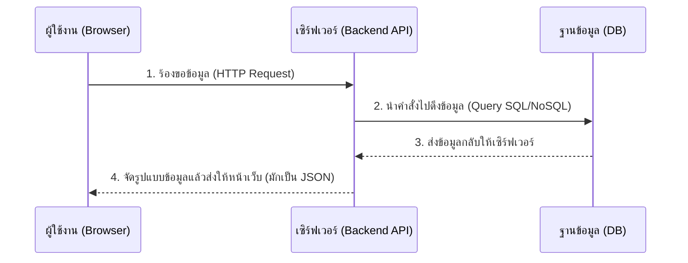
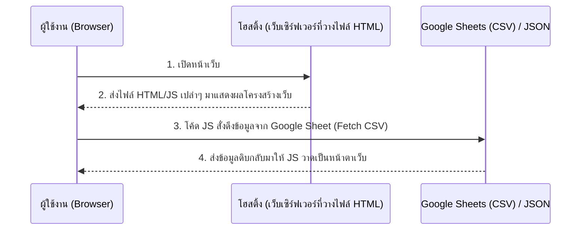

# การประเมินและเปรียบเทียบ Web Architecture

การทำเว็บแบบที่คุณทำอยู่ (ใช้ HTML/JS แล้วดึงข้อมูลจาก Google Sheets ผ่านไฟล์ CSV หรือใช้ไฟล์ JSON/JS ตรงๆ) **เป็นวิธีที่โอเคและมีคนนิยมทำกันมากครับ!** 

โดยเฉพาะสำหรับเว็บไซต์ประเภท Landing Page, เว็บไซต์ข้อมูลองค์กร, พอร์ตโฟลิโอ, หรือเว็บที่เน้นการแสดงผลข้อมูล (Read-only) เป็นหลัก

วิธีนี้ในวงการพัฒนาเว็บมักเรียกว่าสถาปัตยกรรมแบบ **"Serverless"** หรือการใช้ **"Static Site + 3rd Party API"** ซึ่งมีข้อดีคือ **ฟรี, รวดเร็ว, แก้ไขข้อมูลได้ง่าย (ผ่าน Excel/Sheets), และไม่ต้องปวดหัวกับการดูแลเซิร์ฟเวอร์ (Zero Maintenance)**

---

## 1. Flow ปกติของการทำเว็บไซต์ (ที่มี Database ออนไลน์เต็มรูปแบบ)

ในการทำเว็บแอปพลิเคชันทั่วไปที่มีความซับซ้อน (เช่น Facebook, Shopee, ระบบหลังบ้านบริษัท) จะมีโครงสร้างที่เรียกว่า **3-Tier Architecture** ซึ่งต้องมีการสร้าง Database และ Server ออนไลน์:

1. **Frontend (หน้าบ้าน):** HTML/CSS/JS (หรือ Framework เช่น React/Vue) ทำหน้าที่แสดงผลและรับคำสั่งจากผู้ใช้
2. **Backend (หลังบ้าน/API):** Node.js, Python, PHP ทำหน้าที่ประมวลผลตรรกะ ตรวจสอบสิทธิ์ (Security) และเป็นตัวกลางคุยกับฐานข้อมูล
3. **Database (ฐานข้อมูล):** MySQL, PostgreSQL, MongoDB ใช้เก็บข้อมูลอย่างเป็นระบบ

**Flow การทำงานแบบมาตรฐาน:**

---

## 2. Flow ของเว็บไซต์คุณตอนนี้ (Google Sheets / Static JSON)

สิ่งที่คุณทำคือการ **ข้ามฝั่ง Backend และ Database ที่ซับซ้อนไป** แล้วใช้ Google Sheets (หรือไฟล์ JSON) ทำหน้าที่เป็นฐานข้อมูลและ API ให้คุณไปในตัวเลย

**Flow การทำงานปัจจุบันของคุณ:**

---

## 3. เปรียบเทียบความแตกต่าง

| หัวข้อ | แบบที่คุณทำอยู่ (Google Sheets / JSON) | แบบมาตรฐาน (Backend + Database จริง) |
| :--- | :--- | :--- |
| **ค่าใช้จ่าย** | **ฟรี 100%** | มีค่าเช่า Server และ Database รายเดือน/รายปี |
| **ความยาก-ง่าย** | ง่ายมาก (คนเขียนโค้ดไม่เป็นก็แก้ข้อมูลผ่าน Google Sheets ได้) | ยาก (ต้องใช้ Developer เข้าใจเรื่อง Server/Security) |
| **ความรวดเร็วในการพัฒนา** | เร็วมาก (เสร็จในเวลาไม่นาน) | ใช้เวลานาน (ต้องวางโครงสร้างฐานข้อมูลและเขียน API) |
| **ความปลอดภัยของข้อมูล** | ข้อมูลเป็น Public (ใครรู้ URL ก็ดึงไปดูได้) | **สูงมาก** กำหนดสิทธิ์การเข้าถึงข้อมูลได้ละเอียด |
| **การรองรับปริมาณข้อมูล** | เหมาะกับข้อมูลหลักร้อยถึงหลักพันบรรทัด | รองรับข้อมูลหลักล้านบรรทัดสบายๆ |
| **การโต้ตอบกับผู้ใช้** | ทำได้แค่ดึงข้อมูลมาโชว์ (Read-only) | ผู้ใช้สามารถ สมัครสมาชิก, คอมเมนต์, อัปโหลดรูป, ซื้อของได้ |

---

## 4. สรุป: ต้องเปลี่ยนไปสร้าง Database ออนไลน์ไหม?

> [!TIP]
> **คำตอบคือ: "ยังไม่ต้องเปลี่ยนครับ ถ้าความต้องการของเว็บไซต์คุณมีแค่นี้"**

**คุณควรใช้รูปแบบเดิม (ที่ทำอยู่ตอนนี้) ต่อไปถ้า:**
- เว็บไซต์มีจุดประสงค์หลักแค่ให้คนเข้ามาอ่านข้อมูล (เช่น โชว์กิจกรรม, ประกาศข่าวสาร)
- ข้อมูลมีปริมาณไม่เยอะมากนัก
- ต้องการให้คนทั่วไปในทีม (ที่ไม่ใช่โปรแกรมเมอร์) ช่วยอัปเดตข้อมูลได้ง่ายๆ ผ่านหน้าตาตาราง Excel

**แต่คุณ "จำเป็น" ต้องเปลี่ยนไปใช้ Database ของจริง (เช่น MySQL, Firebase, Supabase) ก็ต่อเมื่อเริ่มมีเงื่อนไขเหล่านี้:**
1. **ต้องการระบบ Login / สมัครสมาชิก** เพื่อเก็บข้อมูลส่วนตัวของผู้ใช้ (ห้ามใช้ Google Sheets เก็บข้อมูลความลับหรือพาสเวิร์ดเด็ดขาด)
2. **ต้องการให้ผู้ใช้งานหน้าเว็บสามารถกรอกข้อมูลเข้าสู่ระบบได้** เช่น ทำระบบกระดานสนทนา, ระบบจองคิว, ระบบตะกร้าสินค้า
3. **ข้อมูลเยอะและซับซ้อนมาก** เช่น ต้องค้นหาแบบมีฟิลเตอร์ซับซ้อน หรือข้อมูลเกี่ยวข้องกันหลายตาราง

**ข้อเสนอแนะเพิ่มเติม:** วิธีที่คุณเลือกใช้นั้น **ฉลาดและตอบโจทย์งานสเกลนี้ที่สุดแล้วครับ** ไม่ต้องกังวลว่า "ทำไม่เหมือนชาวบ้าน" เพราะในปัจจุบันนักพัฒนาหลายคนก็นิยมใช้เทคนิคนี้กับโปรเจกต์ขนาดเล็กเพื่อประหยัดเวลาและค่าใช้จ่ายครับ
